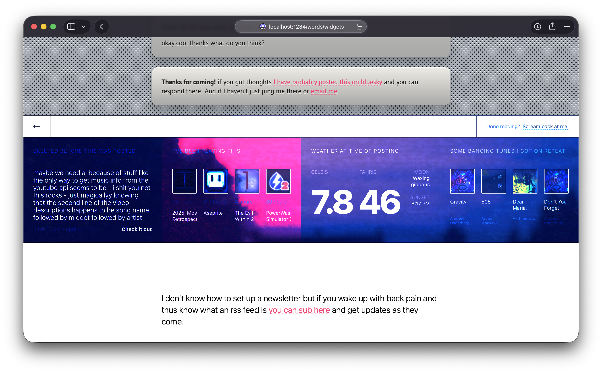
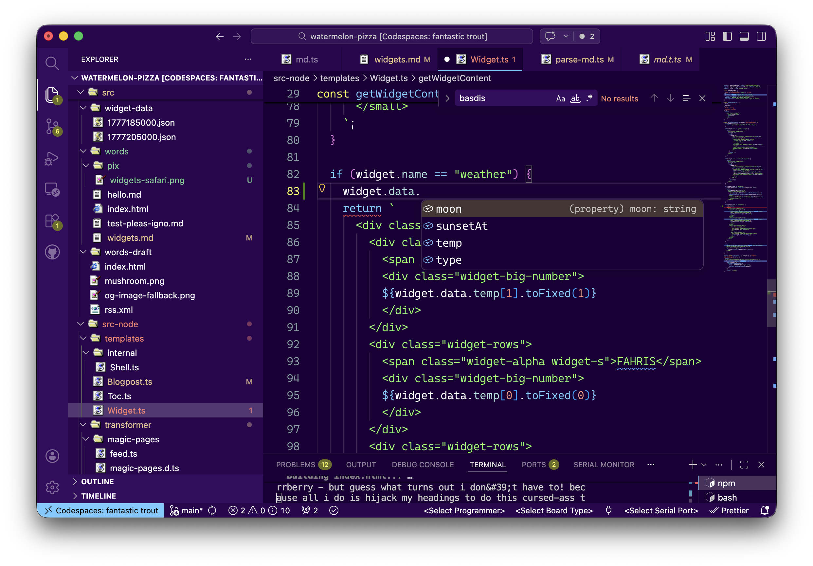

```css
& {
  font-family: "PT Sans", sans-serif;
  background: #a5acb6;
  background-image: url("data:image/svg+xml;utf8,<svg xmlns='http://www.w3.org/2000/svg' width='10' height='10' fill='none' viewBox='0 0 10 10'><path fill='%23F4F5F6' d='M6.5 6C8 6 8 6.672 8 7.5a1.5 1.5 0 1 1-3 0C5 6.672 5 6 6.5 6m-5-5C3 1 3 1.672 3 2.5a1.5 1.5 0 1 1-3 0C0 1.672 0 1 1.5 1'/><path fill='%23171718' d='M6.5 5a1.5 1.5 0 1 1 0 3 1.5 1.5 0 0 1 0-3m-5-5a1.5 1.5 0 1 1 0 3 1.5 1.5 0 0 1 0-3'/></svg>");
  background-repeat: repeat;
  background-size: 10px 10px;
}

article {
  background: linear-gradient(to bottom, #eeebe4, #d4d4d4 50%);
  box-shadow:
    0 1em 1em hsl(0 0 0 / 0.2),
    inset 0 1px 0 0 hsla(0 0 100 / 0.8),
    inset 0 -1px 0 0 hsla(0 0 100 / 0.2);
  border-radius: 1em;
  text-shadow: 0 1px 0 hsla(0 0 100% / 0.5);
  color: #222;
}

img {
  margin-bottom: -2.5%;
}

h1 {
  background: linear-gradient(to top, #1d58b6, #3478e3);
  color: transparent;
  background-clip: text;
  text-shadow: none;
  box-shadow: none;
}

.article-heading {
  text-align: center;
}

h2 {
  color: #fff;
  text-shadow: 0 1px 1px 0 hsla(0 0 0 / 80%);
  background: linear-gradient(to bottom, #1d58b6, #3478e3);
  margin-inline: calc(var(--basis-padding) * -1);
  padding-inline: calc(var(--basis-padding) * 1);
  padding-block: calc(var(--basis-padding) * 0.5);
  box-shadow: inset 0 1px 3px 1px hsla(0 0 0 /20%);
  border-bottom: 1px solid #fff;
  border-top: 1px solid hsla(0 0 0 / 20%);
  text-align: center;
}

a {
  color: #2970a6;
}
```

```css-glob
@import url("https://fonts.googleapis.com/css2?family=PT+Sans:ital,wght@0,400;0,700;1,400;1,700&display=swap");
```

```json
{
  "title": "Widgets!!",
  "date": "1777205310",
  "desc": "Check out the article ends now"
}
```

Wanted to throw some personality at the bottom of posts while staying within the limits of my Netlify account, which was grandfathered into the free forever plan and can basically do anything static and will die immediately when doing anything dynamic. The solution? WIDGETS.


## Leveraging static data in the post-myspace era

Something kinda cool about static blogs is that unlike posts they are relatively fixed in time. i wrote this on a chill sunday that definitely did not feel like 8C (Americans, you also get fahrenheit, I actually scrape those and the have to [convert it](https://github.com/walaura/watermelon-pizza/blob/87191ec390499851e56ed9d383a4e76940f2c45a/packages/local-fetcher/widget/weather.ts#L9-L12))

Widgets normally display live stuff but they also work really well for 'hey this is what was going on back then', journal style. Plus I always wanted to have a little music player on my page. It still won't play music but thats hopefully the easy part, songs are youtubes so i can just stick it in that sticky footer. 👇.

The code is really dumb if you are curious. Since fetching the data happens once i wanted to try out npm subpackages, monorepo style. I had to set this up when doing salsa's food scale and it was a terrible time. It was easier this time thanks to the power of copypaste.

It's hecka cool because now i can throw all the scraping and mangling garbage i want [in here](https://github.com/walaura/watermelon-pizza/blob/87191ec390499851e56ed9d383a4e76940f2c45a/packages/local-fetcher) while keeping the website 'pure'

## How does it work?

Very dumb stuff. i got a little command `npm run fetch` i can run to download all the data the widgets need, this goes through some transformers (here's [bsky](https://github.com/walaura/watermelon-pizza/blob/87191ec390499851e56ed9d383a4e76940f2c45a/packages/local-fetcher/widget/bluesky.ts)). After that it saves a timestamped json into the website folder.

When i run the posts I just go through all of them and find the [closest one in time](https://github.com/walaura/watermelon-pizza/blob/87191ec390499851e56ed9d383a4e76940f2c45a/src-node/transformer/md.ts#L10-L11) then yeet it to the renderer. It's all really silly.

As you may have imagined, the hardest part was getting typescript to cooperate. It did tho and now it can autofill stuff when I am authoring the widgets!!



I also took the chance to improve some stuff around the blog, added descriptions, there's even a secret index page if you can find it! By the way - this is super unrelated but css is getting crazy. See those wavy underlines on the links? see how the color is slightly lighter than the link color? But posts have custom colors right?

```css
text-decoration-color: hsl(from currentcolor h s l / 50%);
/*
lightens whatever color this is inheriting (so text color) 
in real time.
*/

text-decoration-color: hsl(from currentcolor calc(h + 50) s l);
/*
this will hue shift it?? amazing
*/
```

Wild stuff. It's almost tragic everybody moved to radix and tailwind in time for gpus to do all the frontend because they really are missing out.

Anyway!!! real proud of this one, have a happy sunday, don't judge my steam collection too harshly. ta
